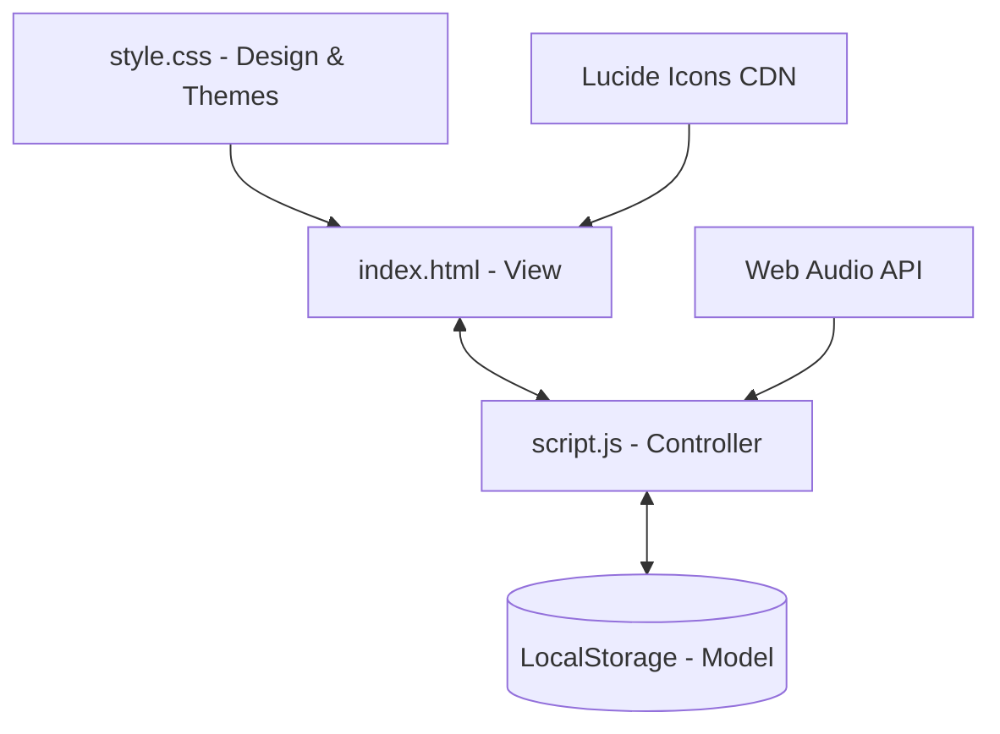

# Project Report: Student Survival Hub

**Project Name**: Student Survival Hub  
**Type**: Frontend Mini-Project  
**Technologies**: HTML5, CSS3 (Vanilla), JavaScript (ES6+), LocalStorage, Lucide Icons, Web Audio API  
**Developer Workspace**: `student-survival-hub/`  

---

## 1. Executive Summary

The **Student Survival Hub** is a lightweight, responsive, client-side web application designed to serve as a comprehensive productivity dashboard for students. The application addresses core academic needs by integrating a task tracker, exam countdown, attendance monitoring system, Pomodoro focus timer, and note-taking vault. 

Operating entirely on the client-side, it eliminates server overhead and security complexities. By leveraging standard browser features like the `Web Storage API (LocalStorage)` and the `Web Audio API`, the application remains fully interactive and functional offline.

---

## 2. System Architecture & Tech Stack



- **Frontend Structure (`index.html`)**: Semantic markup utilizing HTML5 elements (`<aside>`, `<main>`, `<section>`). It employs a tab-based Single Page Application (SPA) structure, hiding and showing sections dynamically using CSS selectors.
- **Styling and Layout (`style.css`)**: Implements standard CSS variables (`:root` tokens) for colors, fonts, shadows, and transition rates. Responsive grids (`grid-template-columns`) and media queries enable responsiveness across desktop, tablet, and mobile platforms.
- **Application Logic (`script.js`)**: Manages the state, operates the Pomodoro intervals, performs calculations, maps elements to DOM templates, and handles all local storage operations.

---

## 3. Core Feature Details & Technical Implementations

### A. Dashboard
The Dashboard serves as the central analytical command center. When loaded, it executes a query across the state object to compute and display:

1. **Total Study Hours**: Dynamically derived by calculating the sum of duration fields in the logged study sessions.
2. **Pending Tasks**: Calculated using a simple array filter: `tasks.filter(t => !t.completed).length`.
3. **Attendance Rate**: Calculated as $\frac{\sum \text{Attended Classes}}{\sum \text{Conducted Classes}} \times 100$, outputting `100%` if no classes have occurred yet.
4. **Days to Next Exam**: Iterates over scheduled exams, computes the mathematical difference in days from the current date, and returns the smallest non-negative day value.
5. **Urgent Tasks and Exams Widgets**: Filters and displays the top 3 highest priority tasks and the top 3 nearest upcoming exams.

### B. Study Sprint (Pomodoro Timer)
The timer uses the standard **Pomodoro technique** (25 minutes of work followed by 5 minutes of rest).
- **UI Animation**: Employs an SVG circular path with `stroke-dashoffset` representing elapsed time:
  $$\text{Offset} = 534 \times \left(1 - \frac{\text{timeRemaining}}{\text{totalTime}}\right)$$
  As time ticks down, the circle contour shrinks smoothly.
- **Offline Audio Alerts**: Uses the browser's **Web Audio API** to dynamically construct a synthesised sine wave frequency of $587.33 \text{ Hz}$ (D5 musical note), fading out after $0.6$ seconds. This technique removes dependencies on external audio files:
```javascript
const audioCtx = new (window.AudioContext || window.webkitAudioContext)();
const oscillator = audioCtx.createOscillator();
oscillator.frequency.setValueAtTime(587.33, audioCtx.currentTime);
```

### C. Task Manager
Provides simple CRUD operations for tasks with three priority states: `High` (🔴), `Medium` (🟡), and `Low` (🟢).
- Users can filter elements based on `All`, `Pending`, or `Completed` statuses.
- Checking a box changes the state and applies a line-through styling directly to the element.

### D. Exam Countdown
Students can enter upcoming exams and view countdown indicators:
- Parses local calendar inputs securely (`YYYY-MM-DD`) and applies localized date-math.
- Displays calculated days remaining for each exam.
- **Pulsing Warning State**: If an exam is scheduled in 3 days or fewer, CSS styling dynamically appends a critical warning badge and trigger animations:
```css
.exam-card.critical .exam-countdown-badge {
    background-color: var(--danger-light);
    color: var(--danger);
    animation: pulse 2s infinite;
}
```

### E. Attendance Tracker
An attendance tracking tool that calculates student compliance with attendance rules (typically $75\%$):
- Users can click immediate `+ Attended` and `+ Conducted` buttons to update ratios without opening forms.
- **Predictive Recommendations**:
  - **If Safe ($\ge 75\%$)**: Calculates the number of upcoming classes that can be missed before falling below $75\%$:
    $$\text{Missable Classes} = \lfloor \frac{\text{Attended} - (0.75 \times \text{Conducted})}{0.75} \rfloor$$
  - **If Danger ($< 75\%$)**: Computes the number of consecutive classes the student must attend to recover their attendance standing:
    $$\text{Required Classes} = \lceil \frac{(0.75 \times \text{Conducted}) - \text{Attended}}{0.25} \rceil$$

### F. Notes Vault
A revision note-taking hub:
- Enables full creation, deletion, and editing operations.
- The editor panel dynamically switches headers and button values depending on whether it is in "Create" or "Edit" mode.
- Extracts unique subjects from existing notes to construct filtering tags at the top of the grid.

---

## 4. LocalStorage Database Schema

All data structures are serialized into a single JSON object stored under the key `survival_hub_state` inside standard browser `LocalStorage`.

| Data Key | Element Type | Fields | Description |
| :--- | :--- | :--- | :--- |
| `theme` | String | `'light'` \| `'dark'` | Visual layout setting |
| `studySessions` | Array of Objects | `id`, `date`, `duration` | Logged focus sessions (in minutes) |
| `tasks` | Array of Objects | `id`, `title`, `priority`, `completed` | Task tracking item properties |
| `exams` | Array of Objects | `id`, `title`, `date` | Scheduled exam dates |
| `attendance` | Array of Objects | `id`, `name`, `attended`, `conducted` | Subject attendance metrics |
| `notes` | Array of Objects | `id`, `title`, `subject`, `content`, `lastUpdated` | Note vault entries |

---

## 5. UI/UX and Theme Customization

- **Responsive Grid Design**: Adapts using media queries:
  - On viewports $> 768\text{px}$, a persistent sidebar nav locks to the left.
  - On mobile displays ($\le 768\text{px}$), the sidebar transitions off-screen and is toggled via a header burger menu button.
- **Dark Mode CSS Variables**: Toggling switches class definitions. Colors automatically change from warm white/gray backgrounds (`#f8fafc`) to slate-black environments (`#0b0f19`).
- **Micro-Animations**: Uses CSS keyframe animations, hover scalings, and transition fades to improve responsiveness.

---

## 6. Conclusion & Future Enhancements

The **Student Survival Hub** provides an all-in-one productivity suite for students, delivering a clean interface with solid offline performance.

### Future Roadmap
1. **GPA Calculator**: Track semester-wise grades and map grade point averages.
2. **Flashcard Reviewer**: Implement active recall decks with Leitner system spacing.
3. **Database Syncing**: Introduce optional MongoDB/Node.js connections to sync files across multiple client devices.
